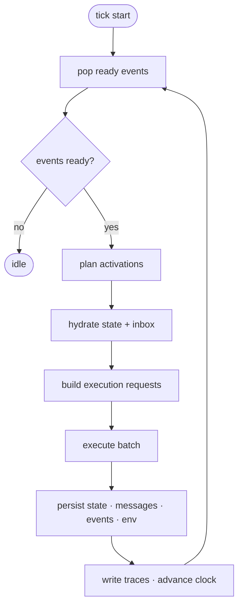

# Architecture

The system is a small event-driven simulation kernel with explicit state, pluggable execution backends, structured messaging, and persistent traces.

The main loop is:

1. Pop ready events.
2. Plan agent activations.
3. Hydrate agent state and recent messages.
4. Build execution requests.
5. Execute batches through a backend.
6. Persist state updates, messages, events, and environment changes.
7. Write traces and advance the clock.

Storage, scheduling, execution, environment dynamics, and observability are independent boundaries. The engine coordinates them but does not own their internal logic.
