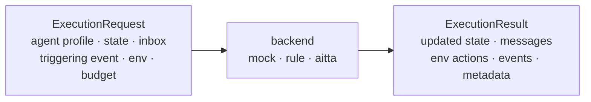

# Execution Model

An activation runs one atomic agent step. The engine sends an `ExecutionRequest` containing the agent profile, current state, selected inbox messages, triggering event, environment snapshot, and step budget.

Every backend must return an `ExecutionResult` with the same structure:

- updated agent state
- outgoing messages
- environment actions
- emitted events
- optional metadata

The mock backend is deterministic and exists for tests and local debugging. The rule backend currently extends the same behavior and is the natural place for richer non-LLM policies.

Run artifacts can be written from the CLI with `--output`. The artifact includes per-tick results, the final summary, final environment state, and structured traces.
